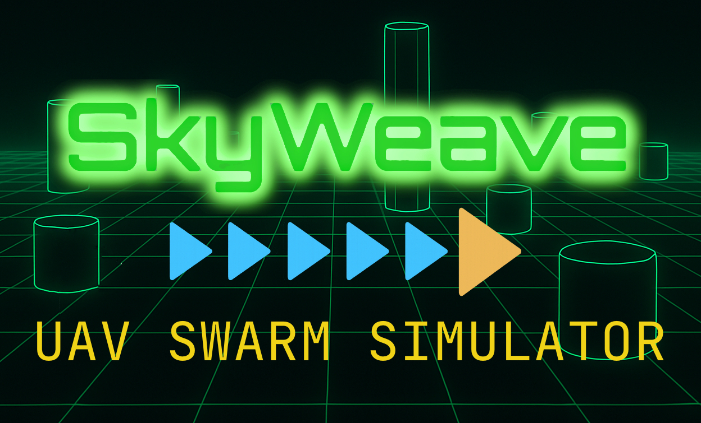

<p align="center">
  
</p>

# **SkyWeave — Autonomous UAV Swarm Simulator**

SkyWeave is an advanced UAV swarm simulation platform built as an Atlas School capstone project.  
It combines a multithreaded C++ physics simulator, a Rust telemetry and command server, and a fully interactive Next.js 3D mission-control interface.

The system demonstrates real-time networking, distributed autonomy, and visually rich telemetry visualization through a unified, modern tech stack.

---

## Table of Contents
- [**SkyWeave — Autonomous UAV Swarm Simulator**](#skyweave--autonomous-uav-swarm-simulator)
	- [Table of Contents](#table-of-contents)
	- [Environment](#environment)
	- [Installation](#installation)
		- [Install UI Dependencies](#install-ui-dependencies)
		- [Run the Rust Backend](#run-the-rust-backend)
		- [Build and Run the C++ Simulator](#build-and-run-the-c-simulator)
	- [Project Structure](#project-structure)
	- [How It Works](#how-it-works)
		- [1. C++ Simulator (UAV Processes)](#1-c-simulator-uav-processes)
		- [2. Rust Telemetry Server](#2-rust-telemetry-server)
		- [3. Next.js 3D Mission Control UI](#3-nextjs-3d-mission-control-ui)
	- [Mission Control Interface](#mission-control-interface)
	- [Core Features](#core-features)
	- [Technical Concepts](#technical-concepts)
		- [UDP Telemetry](#udp-telemetry)
		- [WebSocket Command Stream](#websocket-command-stream)
		- [Autonomous Swarm Cohesion](#autonomous-swarm-cohesion)
		- [R3F + Three.js Rendering](#r3f--threejs-rendering)
	- [Stretch Goals](#stretch-goals)
	- [About the Developers](#about-the-developers)
		- [**Stephen Newby**](#stephen-newby)
		- [**Nash Thames**](#nash-thames)
	- [License](#license)

---

## Environment

This project was developed and tested on:

- **Operating System:** macOS, Linux, & Ubuntu 22.04  
- **Simulation Engine:** C++17 (multithreaded, real-time loop)  
- **Backend:** Rust (Tokio async, actix-web, WebSocket, UDP)  
- **Frontend:** Next.js 14 (React + TypeScript)  
- **3D Engine:** @react-three/fiber (R3F) + Three.js  
- **Deployment:**
  - **Fly.io** (Rust server)
  - **Vercel** (UI)

---

## Installation

Clone the project:

```bash
git clone https://github.com/TheSnewby/Capstone.git
cd Capstone
```

### Install UI Dependencies

```bash
cd ui
npm install
npm run dev
```

UI will be accessible at:

```
http://localhost:3000
```

### Run the Rust Backend

```bash
cd server
cargo run
```

### Build and Run the C++ Simulator

```bash
cd sim
mkdir build && cd build
cmake ..
make -j4
./simulator
```

---

## Project Structure

```
Capstone/
 ├── sim/                         # C++ UAV simulation engine
 │   ├── uav.cpp / uav.h          # Individual UAV dynamics & cohesion logic
 │   ├── simulator.cpp            # Multi-UAV real-time control loop
 │   └── ...
 ├── server/                      # Rust telemetry + WebSocket command server
 │   ├── src/telemetry.rs
 │   ├── src/websocket_server.rs
 │   └── ...
 ├── ui/                          # Next.js mission control interface
 │   ├── app/
 │   ├── components/
 │   ├── public/
 │   └── ...
 ├── README.md
 └── ...
```

---

## How It Works

### 1. C++ Simulator (UAV Processes)

Each UAV runs as an autonomous agent with:

- Local awareness  
- Cohesion / separation / alignment forces  
- Basic pathfinding behavior  
- Adjustable swarm preferences  
- Live state broadcasting over **UDP**

Each UAV transmits packets at ~30Hz:

```
{ position, velocity, orientation, health, ... }
```

---

### 2. Rust Telemetry Server

The Rust server:

- Receives **UDP telemetry** from all UAVs  
- Maintains synchronized global swarm state  
- Handles **WebSocket** connections to the UI  
- Streams telemetry to all connected clients  
- Accepts user movement & formation commands  
- Sends live command packets back to the simulator  
- Stores swarm settings for consistent control

---

### 3. Next.js 3D Mission Control UI

The UI provides:

- A real-time **3D R3F scene**  
- UAV icons, trails, orientation cones  
- Leader highlighting (gold triangle + gold trail)  
- Follower indicators (cyan triangles + cyan trails)  
- Formation controls  
- Command console with keyboard + button input  
- HUD overlays (heading, altitude, speed, WS status)  
- Telemetry table updated every frame  
- NASA‑style CRT aesthetic  

---

## Mission Control Interface

- 3D swarm visualization  
- Grid plane + camera tracking  
- Toggleable flight trails  
- Slider controls for spacing, altitude, velocity  
- Command panel for movement, formation, and altitude control  
- HUD with glowing green text  
- Return-to-splash navigation  
- Responsive layout for both desktop and laptop screens  

---

## Core Features

- Multithreaded UAV physics simulation (C++)  
- Real-time UDP telemetry ingestion  
- Rust-powered WebSocket command dispatcher  
- Fault-tolerant telemetry stream  
- 3D visualization using React Three Fiber  
- Mission-control inspired UI  
- WASD + QE keyboard control system  
- Adjustable swarm parameters  
- Obstacle avoidance

---

## Technical Concepts

### UDP Telemetry  
Lightweight, fast transport for continuous swarm updates.

### WebSocket Command Stream  
Maintains a persistent control channel for movement, formations, and preferences.

### Autonomous Swarm Cohesion  
Implements behaviors similar to Craig Reynolds’ **Boids** model:

- Separation  
- Cohesion  
- Alignment  
- Formation locking  

### R3F + Three.js Rendering  
Handles:

- Real-time UAV rendering  
- Grid + camera logic  
- Trail geometry buffers  
- HUD overlays  

---

## Stretch Goals

- Collision detection  
- Battery simulation + return-to-home logic  
- Additional formations (V, circle, wedge, spiral)  
- Click‑to‑place waypoints  
- Rogue UAV behavior testing  
- Real drone integration (future)  

---

## About the Developers

### **Stephen Newby**
**Project Manager / C++ / Simulation Model**
- UAV Physics   
- Telemetry Sender (UDP)  
- Swarm Cohesion, Spacing, and Autonomy Logic  
- Simulator Threading  
- Pathfinding Algorithms 

GitHub: https://github.com/TheSnewby  
LinkedIn: https://www.linkedin.com/in/stephenjnewby/

---

### **Nash Thames**
**UI / Rust / System Architecture**
- 3D Mission Control Interface  
- WebSocket + UDP Rust Backend  
- Telemetry Pipeline 
- UI Design 
- App Construction + Deployment

GitHub: https://github.com/internashionalist  
LinkedIn: https://linkedin.com/in/nashthames  

---


---

## License

This project is open-source under the **Public Domain**.  
Use, modify, extend — no restrictions.